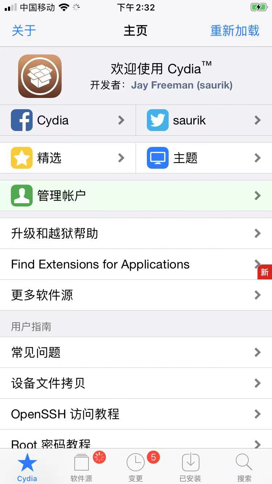

# Cydia

TODO：

* 【记录】已越狱的iOS中的Cydia的情况：已安装源和插件
* 【已解决】已越狱iPhone中Cydia中安装Cydia Substrate
* 【未解决】Cydia安装BigBoss源的iFile出错：无法购买Cydia is not yet prepared to accept money

---

* `Cydia` = `Cydia Installer`
  * 概述
    * `iOS <15.0`=之前：最常用的越狱包管理器（之一）
      * iPhone APT frontend used on >30 million jailbroken devices
    * `iOS >=15.0`=现在：不太常用了
      * 现在很多都改用[Sileo](../sileo/README.md)或[Zebra](../zebra/README.md)等其他包管理器了
  * 长啥样
    * 
  * 是什么
    * software installer=package manager
    * a frontend for APT
    * 可以理解为：已越狱iOS的AppStore
  * Cydia名称的由来：`Cydia pomonella`
    * `Cydia pomonella` = `苹果蠹蛾` = `苹果小卷蛾`
      * （水果中的）苹果，有了虫 -》 很讨厌，惹人烦
        * 就像Cydia作者`saurik`对于Apple对苹果设备的各种限制的做法的感觉很让人烦
  * 作者：`Jay Freeman (saurik)`
    * 官网
      * [Table of Contents - Jay Freeman (saurik)](https://www.saurik.com/)
  * 概述
    * Cydia is an open source software installer created by saurik that uses the Debian APT system for package management
      * Cydia is an alternative to Apple's App Store for "jailbroken" devices, at this time including iPhones, iPads, and iPod Touches, specializing in the distribution of all that is not an "app".
  * 说明
    * Cydia is not available in Apple's App Store, nor is it a website: it is installed on your device using a "jailbreaking" tool
      * 有哪些越狱工具，详见：
        * [iPhone越狱概述 · iOS逆向开发：iPhone越狱](https://book.crifan.org/books/ios_re_iphone_jailbreak/website/iphone_jailbreak_overview/)
  * 源=repos=repositories=sources
    * 通过源，安装不同包
    * 自带源
      * `BigBoss`
      * `ModMyi`
      * `ZodTTD/MacCiti`
      * `repo666.ultrasn0w.com`
      * `Telesphoreo`
