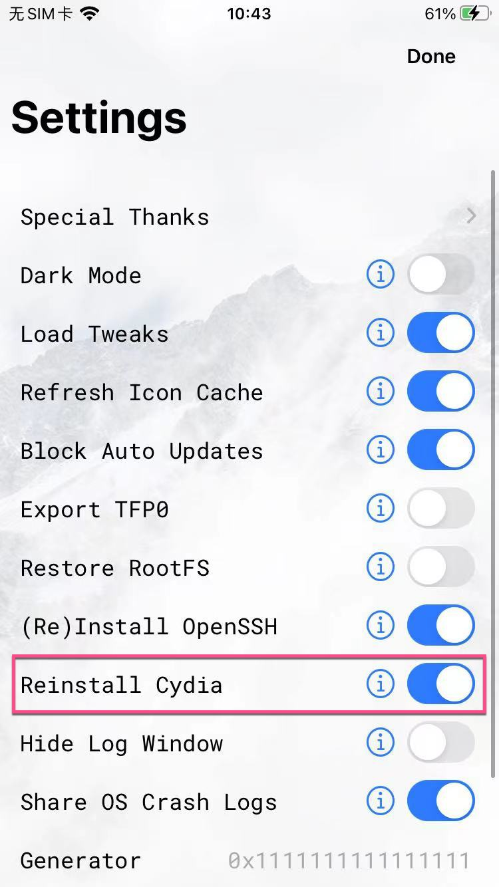
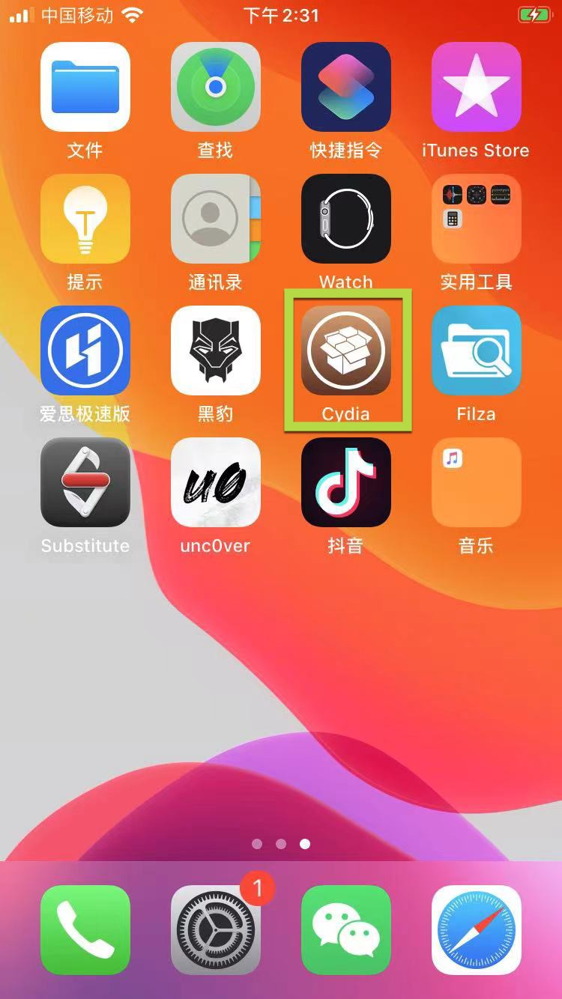
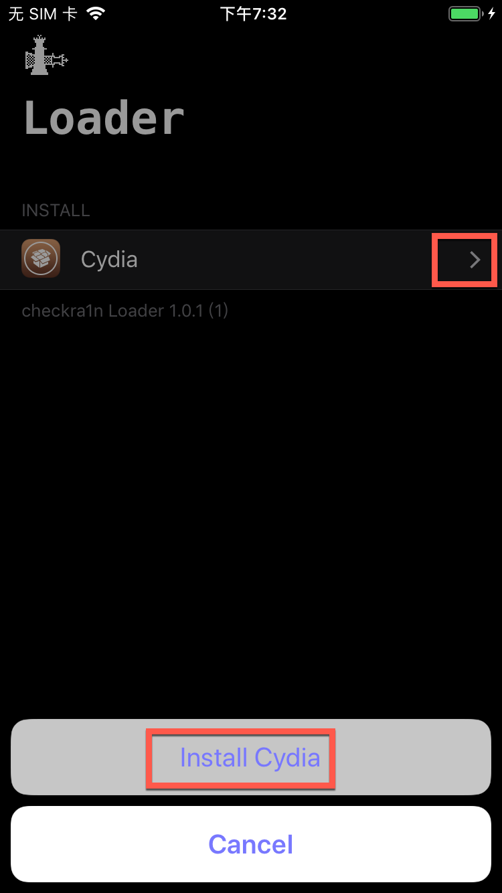

# 安装Cydia

* 安装Cydia
  * unc0ver越狱：往往无需额外手动安装Cydia
    * 设置中默认已勾选：`Reinstall Cydia`
      * [设置选项 · iOS逆向开发：iPhone越狱](https://book.crifan.org/books/ios_re_iphone_jailbreak/website/doing_jailbreak/do_jailbreak/unc0ver/use/ios1361_iphone7/settings.html)
        * 
    * 则越狱后：自带已安装Cydia
      * [unc0ver越狱后 · iOS逆向开发：iPhone越狱](https://book.crifan.org/books/ios_re_iphone_jailbreak/website/after_jailbreak/unc0ver/)
        * 
  * checkra1n越狱：checkra1n越狱后，需要手动安装Cydia
    * 越狱后，需要自己手动去从checkra1n中去安装Cydia
      * 概述
        * `checkra1n`->`Loader`->`Cydia`->`Install Cydia`
          * 
      * 详解
        * [安装Cydia · iOS逆向开发：iPhone越狱](https://book.crifan.org/books/ios_re_iphone_jailbreak/website/after_jailbreak/checkra1n/install_cydia.html)
