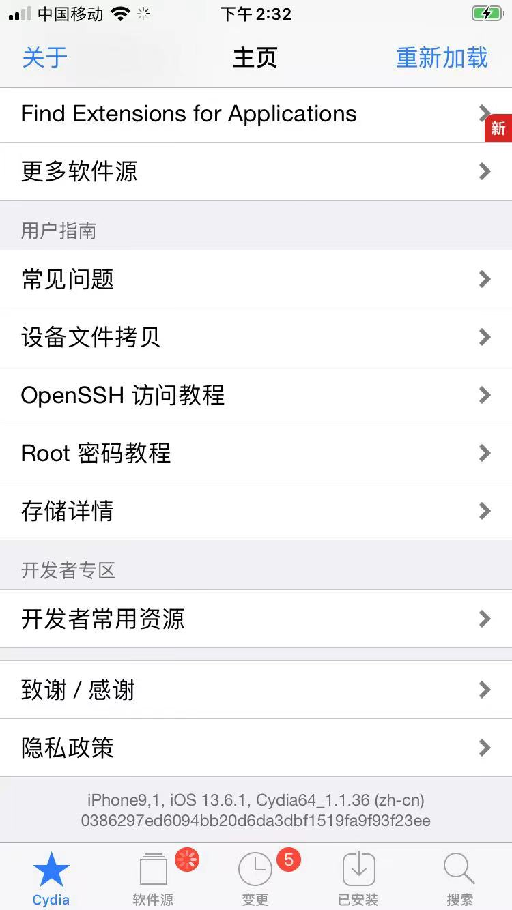
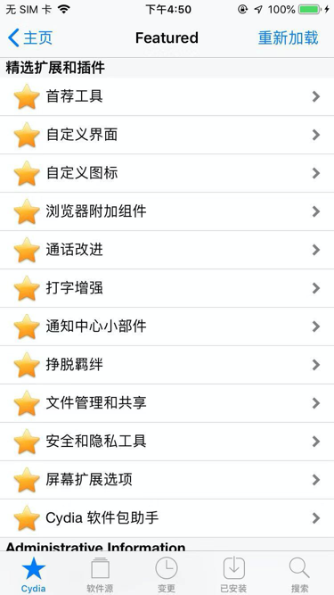
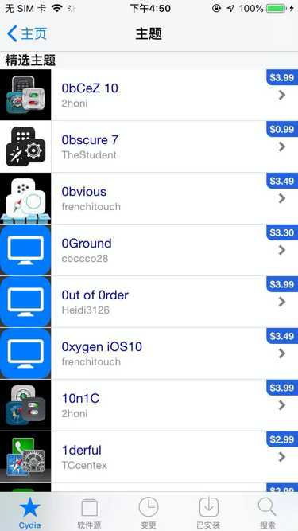
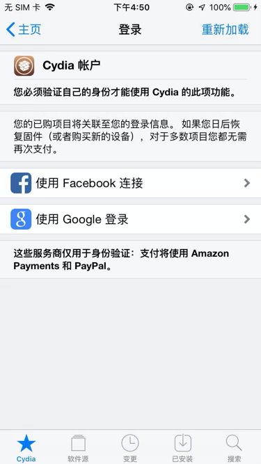
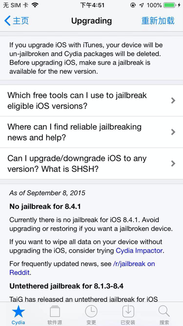
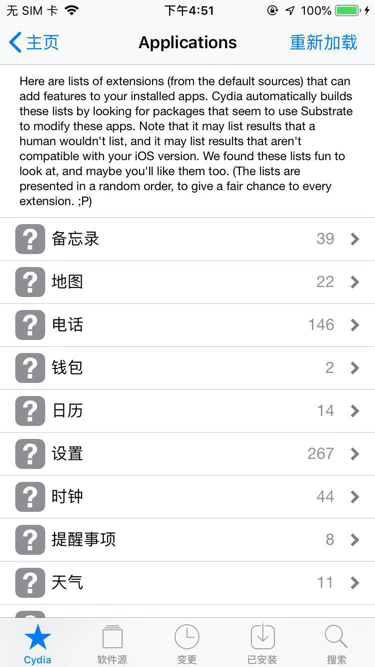
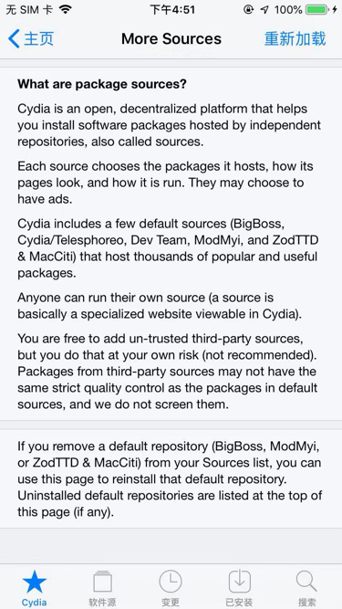
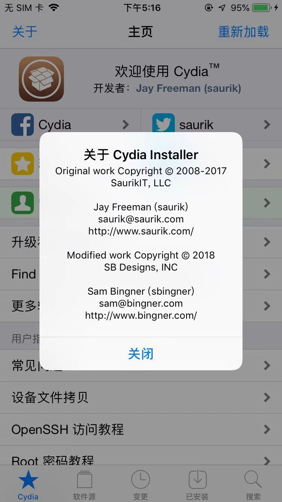

# Cydia

* `Cydia`
  * 主页
    * 
    * 
  * 子模块
    * 精选
      * 
    * 主题
      * 
    * 管理账户
      * 
    * 升级和越狱帮助
      * 
    * Find Extension for applications
      * 
    * 更多软件源
      * 
        * Cydia is an open, decentralized platform that helps you install software packages hosted by independent repositories, also called sources.
        * Each source chooses the packages it hosts, how its pages look, and how it is run. They may choose to have ads.
        * Cydia includes a few default sources (BigBoss, Cydia/Telesphoreo, Dev Team, ModMyi, and ZodTTD & MacCiti) that host thousands of popular and useful packages.
        * Anyone can run their own source( a source is basically a specialized website viewable by Cydia)
        * you are free to add un-trusted third-party sources, but you do that at your own risk(not recommended). Packages from third-party sources may not have the same strict quality control as the packages in default sources, and we do not screen them.
  * 左上角：关于
    * 
