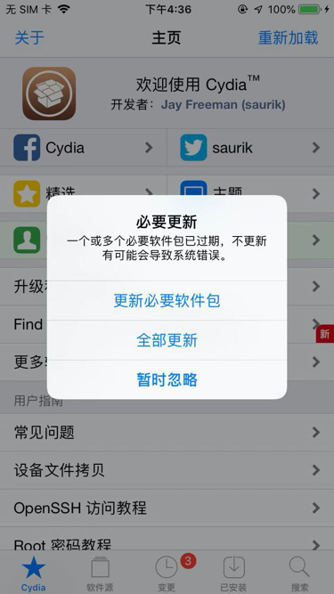
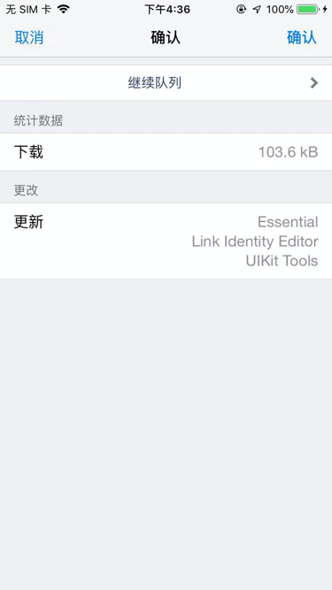
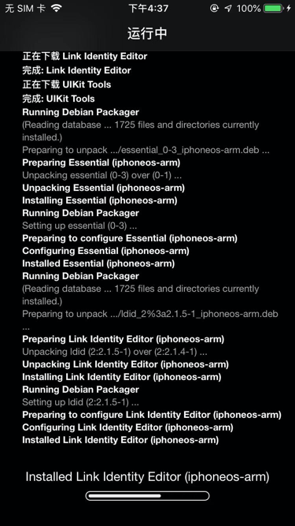
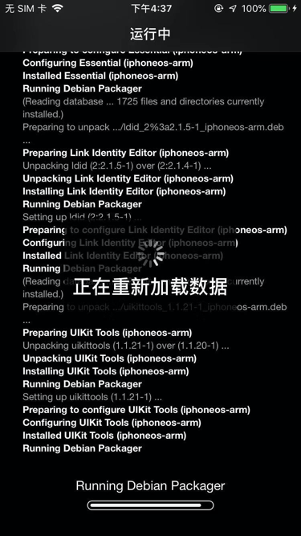
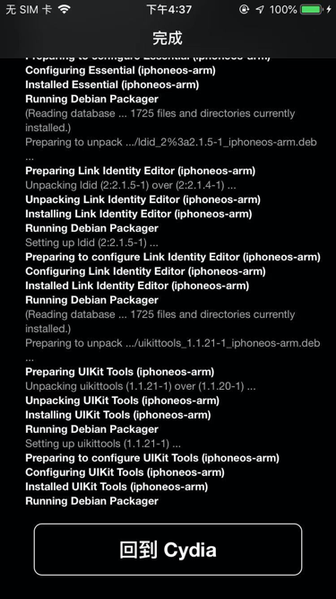
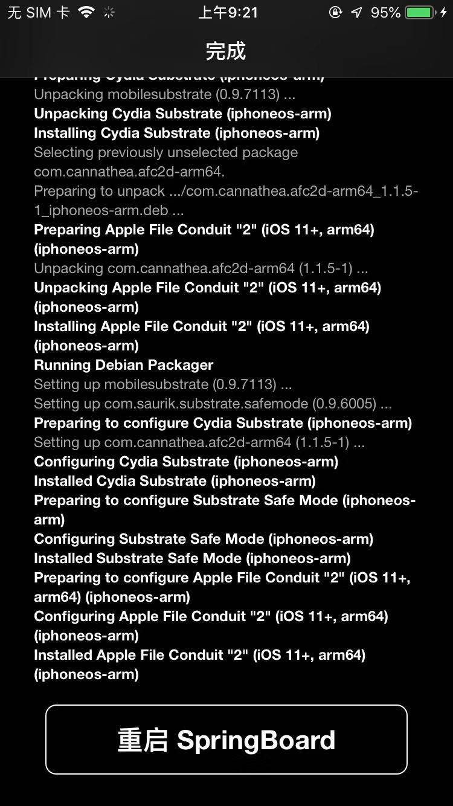

# Cydia插件更新

有时候，Cydia检测到有些插件有更新的版本时，会弹框提示更新：



```bash
必要更新
一个或多个必要软件包已过期，不更新有可能会导致系统错误。

更新必要软件包
全部更新
暂时忽略
```

点击：`全部更新`，进入确认界面：



点击右上角的：`确认`，进入：`运行中`




安装到最后时会有：

* 正在重新加载数据
  * `Running Debian Packager`
    * 

安装完毕后，显示：`回到Cydia`



* 注
  * 别的时候，安装完毕插件后，往往会显示：`重启SpringBoard`
    * 

即可。
