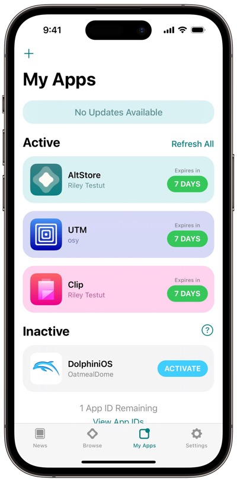

# 包管理器概述

* `包管理器`=`package manager`
  * 俗称：越狱版`App Store`
  * 作用：（iOS设备越狱后）安装各种插件和app
  * 概述
    * 常见包管理器
      * `iOS 15`之前的：`Cydia`
      * `iOS 15`之后的：`Sileo`、`Zebra`等

## iOS包管理器 详解

* iOS包管理器 详解
  * 越狱后的iOS
    * 想要安装各种app、插件等，通过：
      * package manager = 包管理器
        * = 越狱版AppStore = Jailbreak App Store
        * = software installer = 软件（包）安装器
        * = App Installer = 应用安装器
        * third-party software distribution system = 第三方软件发布系统
        * 也常叫做
          * `Cydia alternative`
    * 越狱版AppStore
      * 最主流的
        * `Cydia`
          * （`< iOS 15`）最常用的包管理器
        * `Sileo`
          * （`iOS 15+`）最常用的包管理器
      * 其他（可能也算作是）
        * `Zebra`
        * `zJailbreak`
        * `BuildStore`
        * `Zestia`
        * `Tutubox`
        * `Zee-AppStore`
  * 非越狱iOS
    * 想要（绕过官网的App Store）安装其他第三方的iOS的app，（但又不想要越狱）可以用
      * 非越狱版AppStore = no Jailbreak AppStore=non-jailbreak AppStore
        * `AltStore`
          * 主页
            * https://altstore.io/
              * Sideloading for Everyone
                * Discover the apps you can't find on the App Store
          * 图
            * 
        * `IPackager`
        * `Hydia`
        * `iNoCydia`
        * `FullPak`
