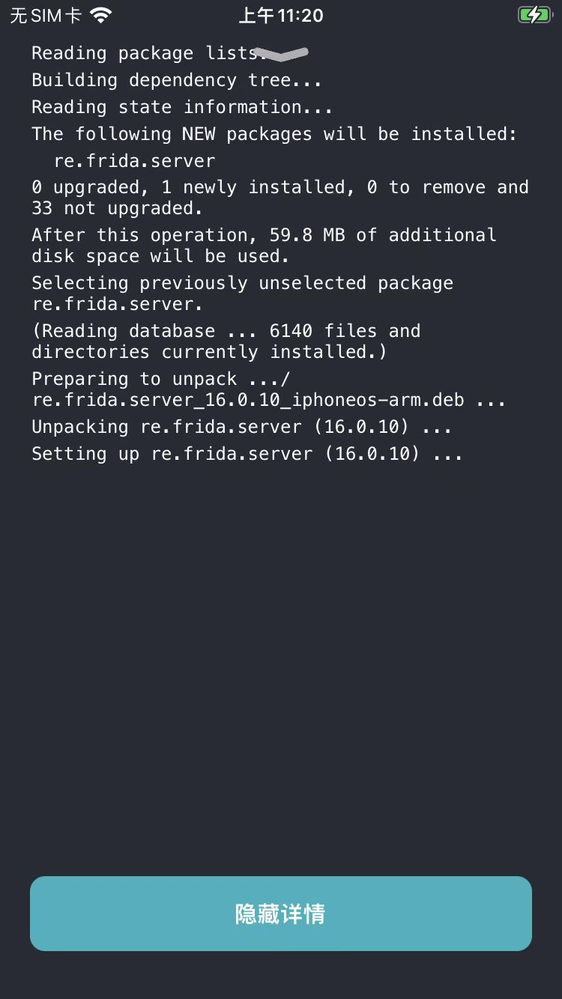

# 通过软件源安装Frida插件

* 已知：Frida的软件源是 https://build.frida.re

现在去Sileo中，通过添加软件源 https://build.frida.re 的方式，去安装Frida插件：

## 点击加号➕新增软件源

有两种方式：

* 复制后粘贴软件源地址
* 手动输入软件源地址

### 复制后粘贴软件源地址

通过系统剪贴板，已复制了： https://build.frida.re

再去先切换到Sileo中的`软件源` ，点击右上角的`➕`=`加号`，则会自动检测出并弹框：

添加软件源 的弹框：

点击 添加1个软件源

### 手动输入软件源地址

或者是，点击加号+后，出现，可供输入软件源地址的弹框中，手动输入输入软件源地址：

再点击 添加软件源

## 进入插件详情页

然后，稍等片刻，即可看到更新好后的（带图标的、显示插件总个数的）软件源：

点击软件源，此处的Frida，进入插件列表页面：

找到对应的插件：此处可以看到Frida插件，点击后，可以进去：

Frida插件详情页

## 点击安装插件

点击对应的`获取`，此时会看到页面底部出现一个`队列`：

且原先`获取`按钮，也变成了`队列`按钮 -》 表示该插件已经加入到了，待安装的列表中

点击底部的队列，可以展开看到详情：

点击`确认`，即可开始下载插件：

并安装插件：

## 查看安装详情过程

下载和安装完成后，会显示：`显示详情`，点击`显示详情`，会打开安装过程的详情页：

即可安装完毕。

## 查看已安装的插件

而如果切换到Sileo主页，切换到tab页`软件包`，根据`日期`=时间先后排序，则可以在已安装插件列表中看到刚安装的Frida插件：

