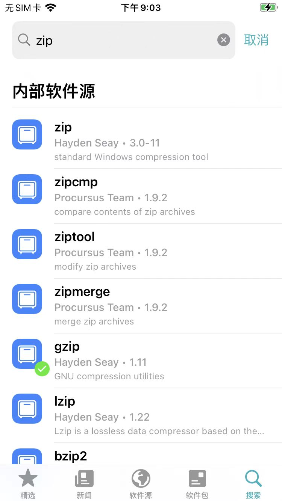

# 通过搜索安装插件

可以通过`Sileo`中的`搜索`去搜索并安装所要的插件。

## 注意事项

值得一提的值：

* `Sileo`普通版本：只能从当前已添加的软件源的内部去搜索已有的插件
  * 举例
    * （`palera1n`越狱后，安装的普通版本的`Sileo`中）搜`zip`时，只能搜到内部软件源的结果
      * 
* [XinaA15](https://book.crifan.org/books/ios_re_ios15_jailbreak/website/xinaa15/)（越狱后自动安装的）`Sileo Nightly`：支持同时从外部软件源中搜索
  * 作用=好处：极大的方便了插件的安装
    * 当内部软件源找不到插件时，自动从搜索的外部的软件源中，找到并添加软件源和安装相应插件
  * 举例
    * 搜`Frida`可以搜到外部软件源
      * 
