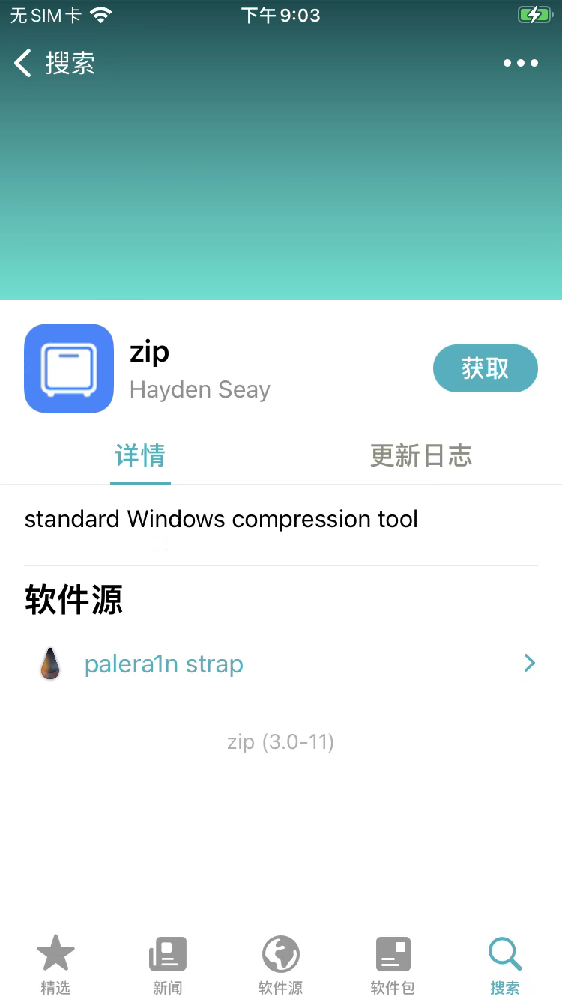
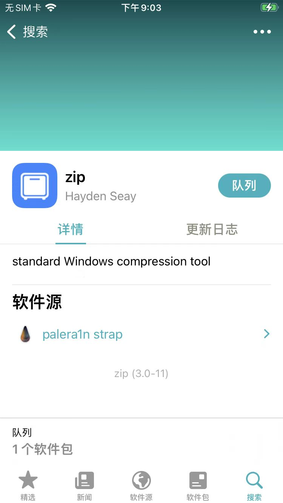
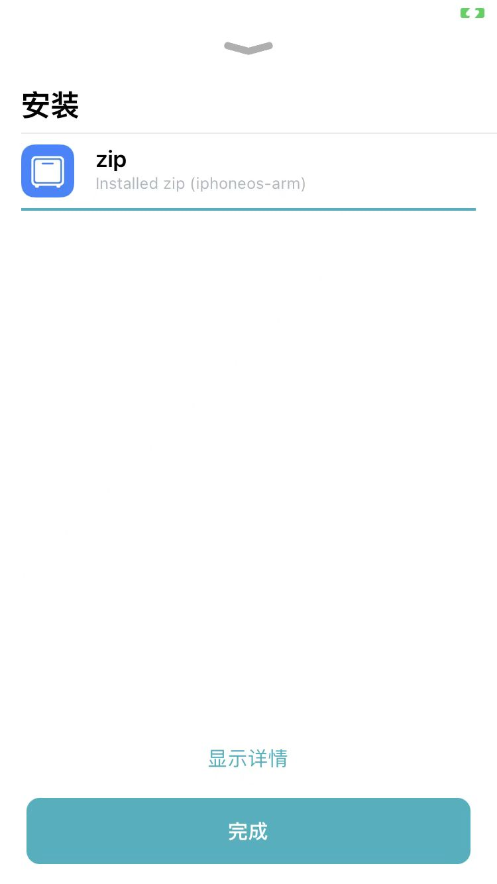
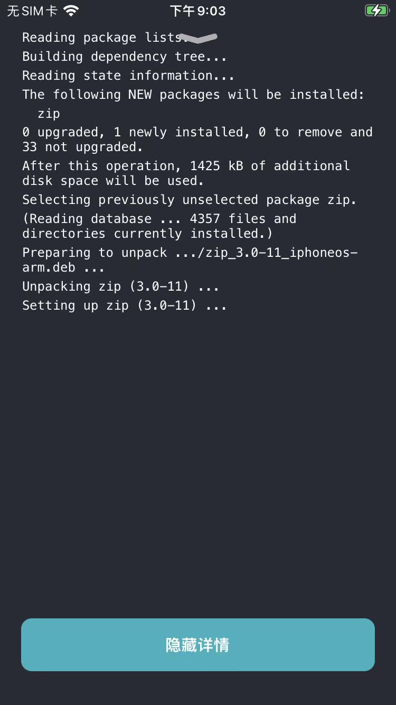

# 通过搜索并安装zip插件

此处以搜索并安装`zip`插件为例，来介绍典型的用Sileo安装插件的过程：

（在已安装对应的`软件源`的前提下），Sileo中切换到搜索页，输入：`zip`，可以搜到内部软件源中的zip：

点击zip，进入插件的详情页：

点击`获取`

此时会把此处要安装的插件，此处的`zip`，加到一个（此处的待`安装`）列表中

对应页面变化是：

底部会出现：

* 队列
  * 1个软件包
    * 

点击`队列`，可以看到列表中的zip：

点击`确认`后，开始下载，下载完毕后，会自动安装

安装完毕后显示：

`Installed zip (iphoneos-arm)`

其中：
* `iphoneos-arm`
  * 表示对应的版本=架构是：`arm`

如果想要查看详情的安装过程，可以点击`显示详情`

会列出整个的内部详细操作的log日志。

目的：

* 查看具体安装的deb包、插件版本号
* 万一安装有问题，可以及时发现（相关的警告⚠️和错误❌等信息）
