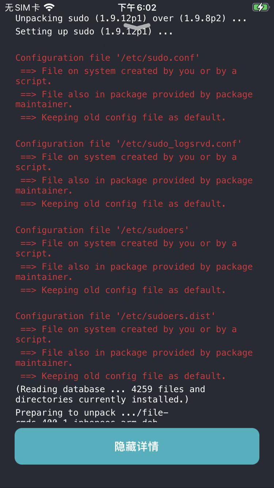
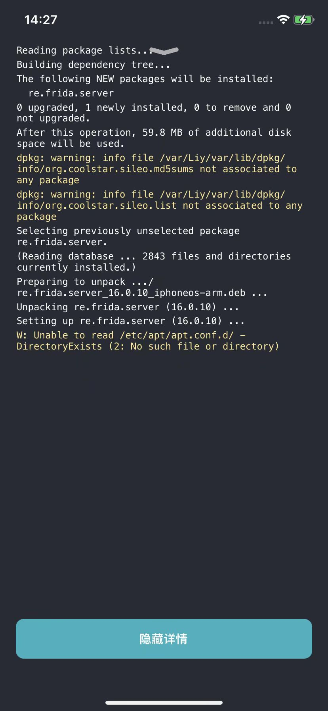
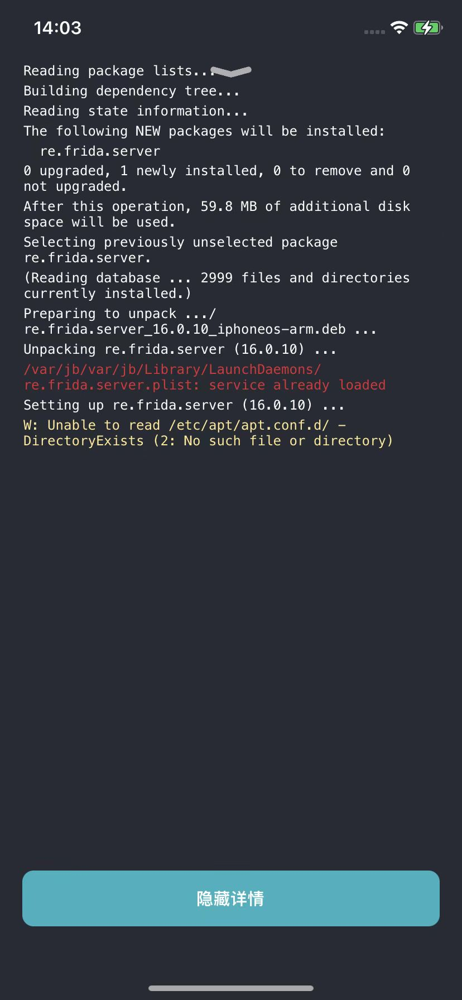

# Sileo经验和心得

## Sileo中安装插件的详情中出现黄色警告或红色错误

Sileo安装插件期间，最好点击`显示详情`，看看安装过程

* 正常的话，看到的都是
  * 表示一切正常的白色文字
    * 比如
      * 正常安装frida后的显示详情中，没有黄色的警告或红色的错误
        * 

但是有时候会出现，会看到：

* **黄色**的`Warning`=`警告`=⚠️
* **红色**的`Error`=`错误`=❌

而出现这类问题，最好搞清楚情况。

尤其是红色error错误，往往是出了什么错误，需要解决掉，后续插件才能正常使用。

### 举例

（1）某次更新插件后出现的红色字体的错误：

（2）重新安装frida（frida-server），出现的黄色警告

原因可能是：frida对于rootless的支持不够好导致的

（3）frida安装出现错误

安装frida出现红色错误

意思是，frida的服务已启动

说明之前已有frida的服务，说明是异常的问题

