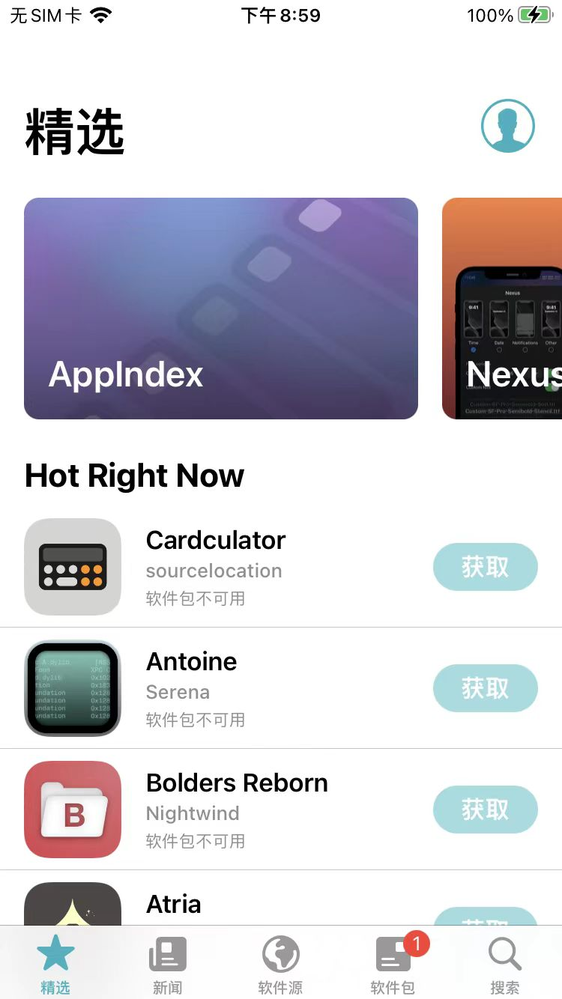
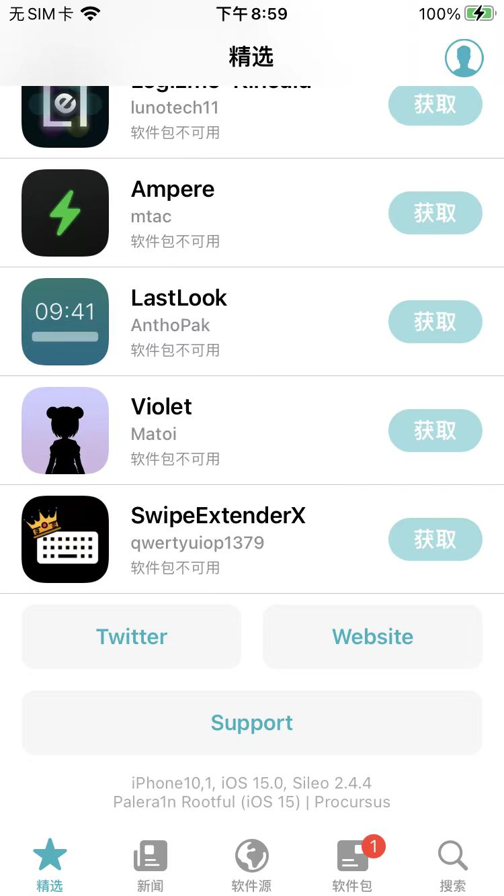

# 精选

## 热门插件

* 顶部显示热门的、精选的应用=插件
  * 

## 版本等信息

* 底部有显示有相关信息
  * 
    * `Sileo`的版本信息
      * `Sileo 2.4.4`
    * iPhone信息
      * iOS设备类型：`iPhone10.1` = `iPhone 8`
      * iOS版本：`iOS 15.0`
    * 越狱工具信息
      * 越狱工具：`palera1n`
        * 越狱类型：`Rootful`
        * iOS系统版本：`iOS 15`
          * 底层bootstrap：`Procursus`
