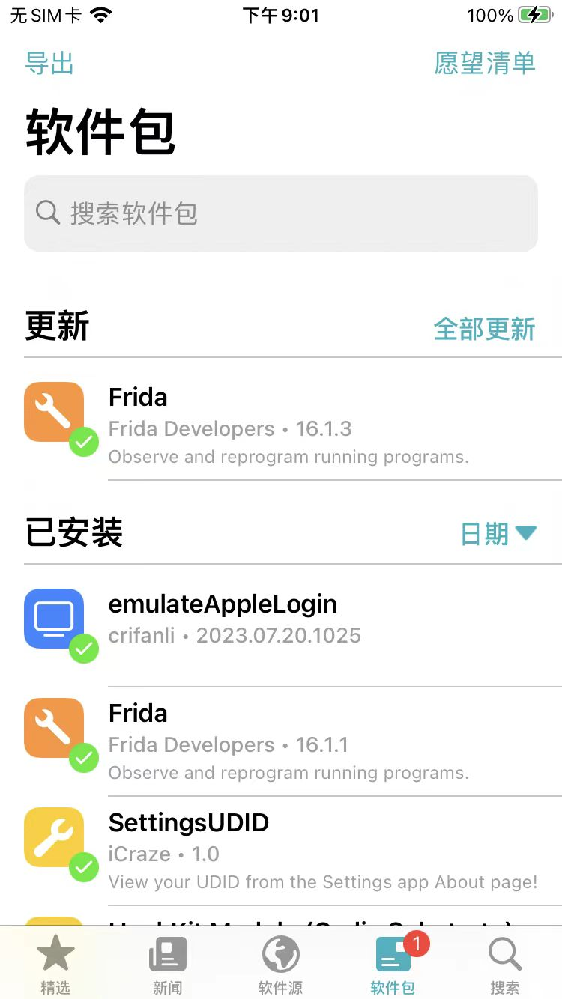
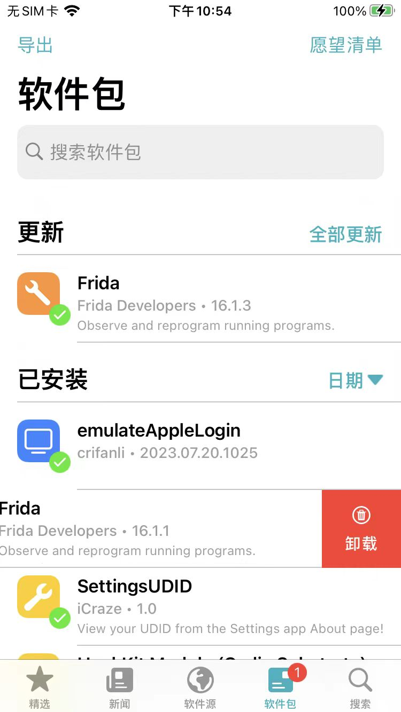
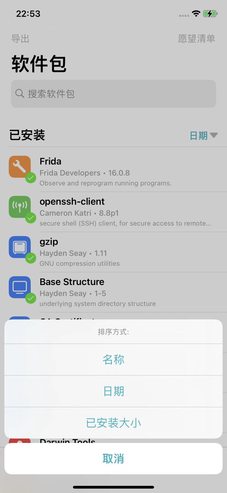

# 软件包=插件

列出已安装的插件和有更新的插件：

## 支持左滑操作

支持单个插件的左滑，会出现操作按钮，比如：`卸载`

举例：

* Frida
  * 

## 支持多种排序方式

对于`插件`=`包`的列表的显示，支持多种排序方式：

点击`已安装`右边的位置，默认显示是`日期`的按钮后，可以显示更多排序类型：`名称`、`日期`、`已安装大小`

可以根据需要，切换成其他排序方式。
