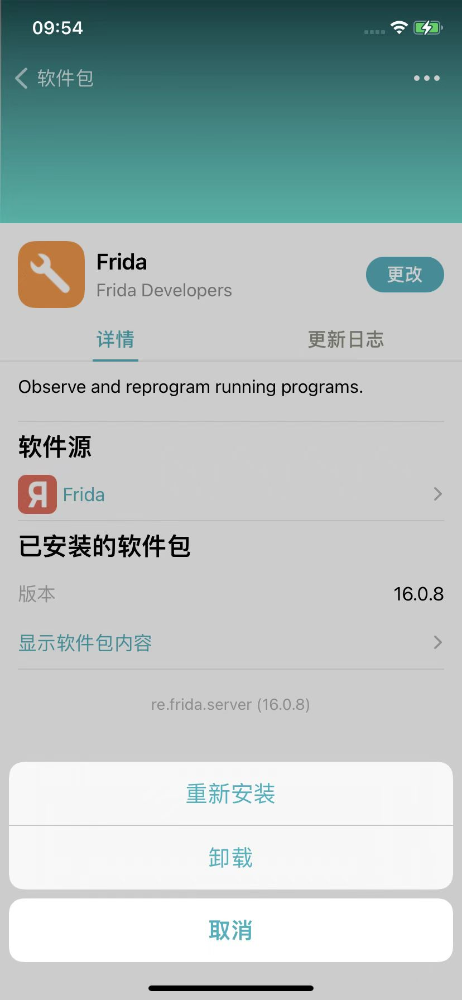
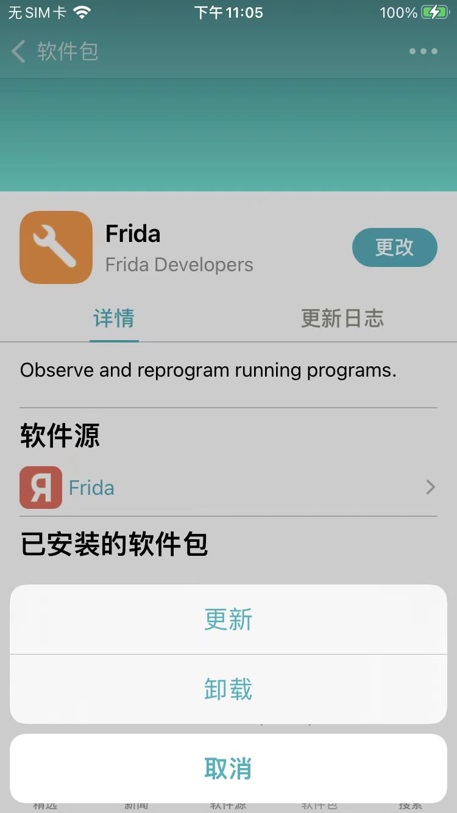
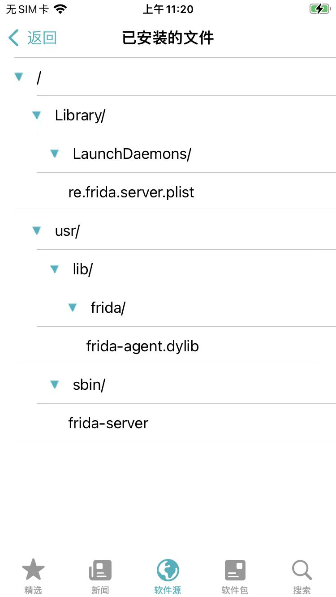
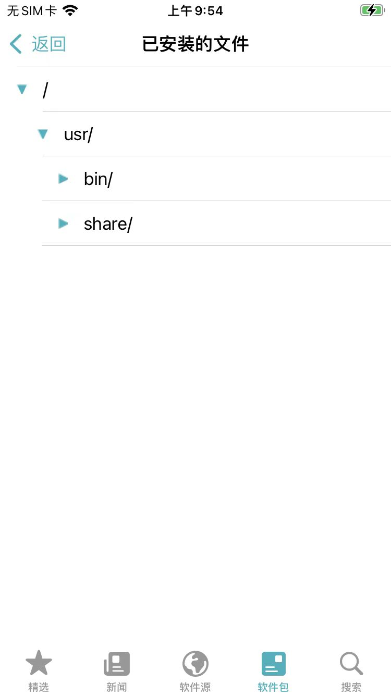
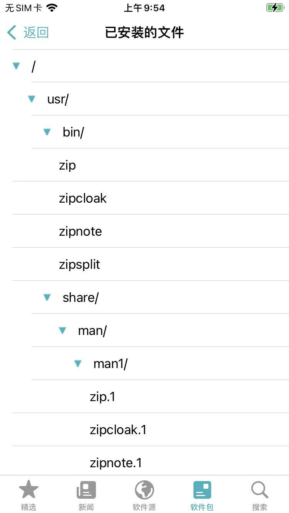

# 插件详情页

进入插件详情页，除了显示基本信息外，还有一些其他功能和用法：

## 插件的按钮文字和含义

* 插件详情页的右上角的按钮
  * 刚进入插件页面，还没安装插件之前显示：`获取`
    * 
      * 点击`获取`，则加入将要安装的队列中
  * 点击了`获取`后，将要安装时显示：`队列`
    * 
      * 点击了底部的`队列`，去安装
  * 已安装后，则显示：`更改`
    * 
      * 点击`更改`，则弹框列出支持的操作：
        * 没有新版更新时显示：`重新安装`、`卸载`
          * 
        * 有新版更新时显示：`更新`、`卸载`
          * 

## 显示软件包内容 = 已安装的文件

点击`显示软件包内容`，则可以进入`已安装的文件`页面，查看该插件安装了哪些文件。

举例：

* Frida
  * 
* zip
  * 默认没有展开全部文件
    * 
  * 可以点击一层层展开
    * 
  * 直到展开所有层级
    * 
